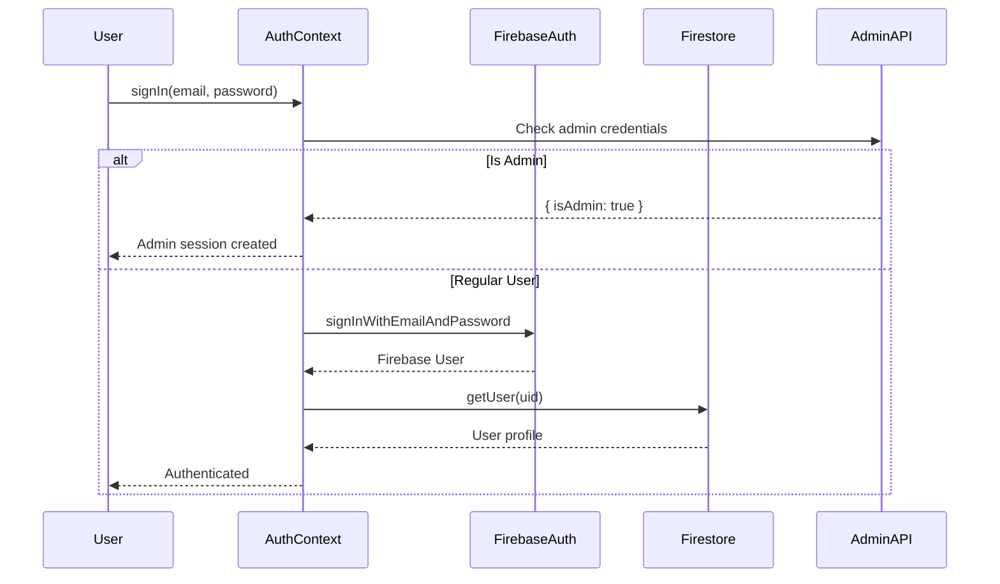
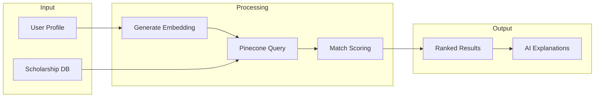
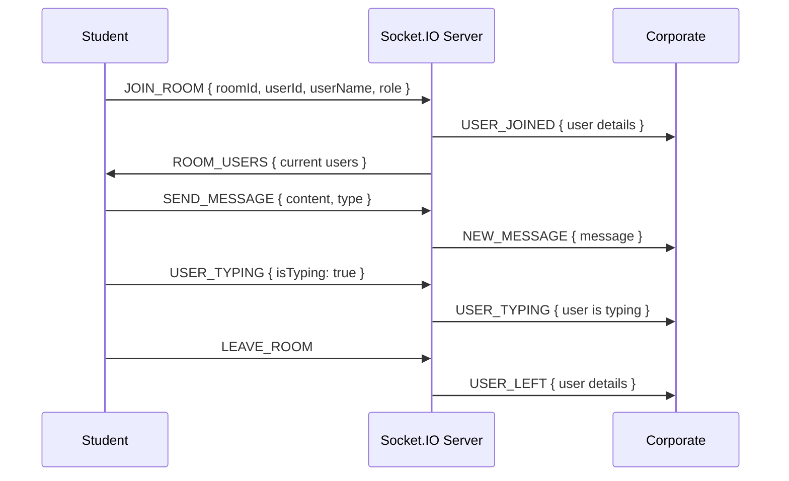
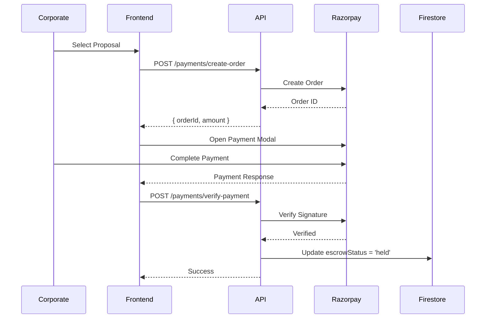
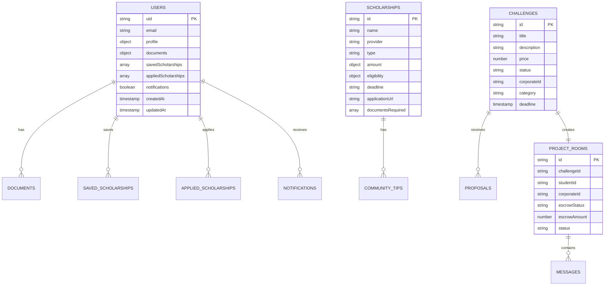
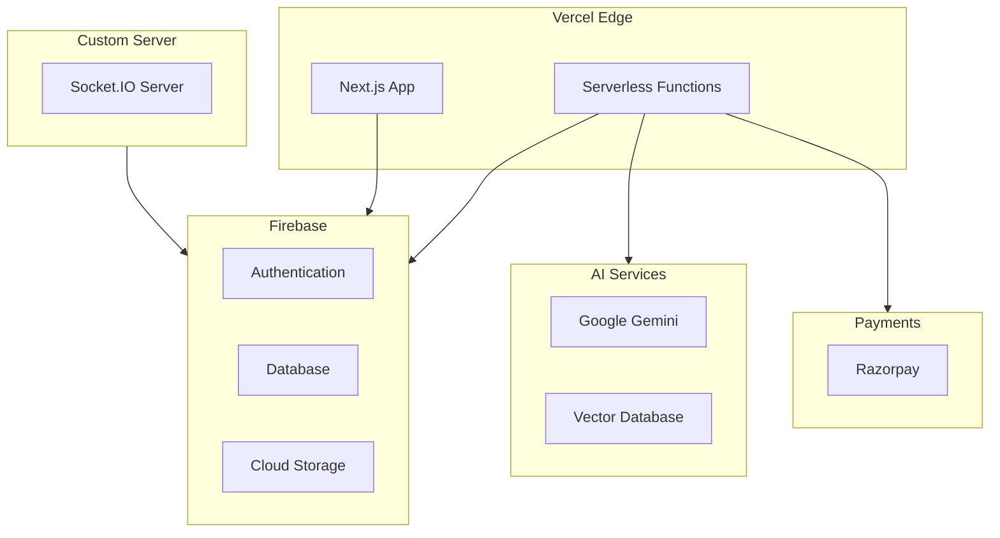

# 🏗️ ScholarSync Architecture Documentation

> A comprehensive guide to the system architecture, design patterns, and technical decisions.

---

## 📊 High-Level Architecture

```mermaid
graph TB
    subgraph Client["🖥️ Client Layer"]
        LandingPage["Landing Page"]
        Dashboard["Dashboard"]
        Fellowships["Fellowships Module"]
        Auth["Auth Pages"]
    end
    
    subgraph NextJS["⚡ Next.js App Router"]
        Pages["Pages (app/)"]
        Components["Components"]
        Hooks["Custom Hooks"]
        Contexts["Context Providers"]
    end
    
    subgraph API["🔌 API Layer"]
        ScholarshipAPI["Scholarships API"]
        PaymentsAPI["Payments API"]
        DocumentsAPI["Documents API"]
        AdminAPI["Admin API"]
        EmailAPI["Email API"]
        ChatbotAPI["Chatbot API"]
    end
    
    subgraph Services["🔧 Service Layer"]
        LangChain["LangChain Chains"]
        Pinecone["Pinecone Client"]
        SocketIO["Socket.IO Server"]
        Razorpay["Razorpay Client"]
        OCR["Tesseract OCR"]
    end
    
    subgraph External["☁️ External Services"]
        Firebase["Firebase Suite"]
        GeminiAI["Google Gemini 2.5"]
        PineconeDB["Pinecone Vector DB"]
        RazorpayGW["Razorpay Gateway"]
    end
    
    Client --> NextJS
    NextJS --> API
    API --> Services
    Services --> External
```



---

## 🗂️ Project Structure

```
ScholarSync/
├── 📁 src/
│   ├── 📁 app/                    # Next.js App Router
│   │   ├── 📁 api/               # 14 API Route Modules
│   │   │   ├── 📁 admin/         # Admin operations (9 endpoints)
│   │   │   ├── 📁 analytics/     # User analytics
│   │   │   ├── 📁 calendar/      # Calendar events
│   │   │   ├── 📁 chatbot/       # AI chatbot
│   │   │   ├── 📁 community/     # Community features
│   │   │   ├── 📁 documents/     # Document upload/delete
│   │   │   ├── 📁 email/         # Email verification (3 endpoints)
│   │   │   ├── 📁 fees/          # Fee analysis with OCR
│   │   │   ├── 📁 intelligence/  # AI intelligence
│   │   │   ├── 📁 payments/      # Razorpay integration (3 endpoints)
│   │   │   ├── 📁 profile/       # User profile management
│   │   │   ├── 📁 scholarships/  # Scholarship matching (5 endpoints)
│   │   │   ├── 📁 scraper/       # Web scraper
│   │   │   └── 📁 stacking/      # Scholarship stacking
│   │   ├── 📁 auth/              # Authentication pages
│   │   ├── 📁 dashboard/         # Dashboard (9 sub-pages)
│   │   └── 📁 fellowships/       # Fellowships module (9 sub-pages)
│   │
│   ├── 📁 components/            # React Components
│   │   ├── 📁 analytics/         # Analytics components
│   │   ├── 📁 auth/              # Auth forms (2 files)
│   │   ├── 📁 blocks/            # UI blocks (8 files)
│   │   ├── 📁 calendar/          # Calendar components
│   │   ├── 📁 chatbot/           # Chatbot UI
│   │   ├── 📁 dashboard/         # Dashboard components
│   │   ├── 📁 documents/         # Document vault
│   │   ├── 📁 fees/              # Fee analyzer
│   │   ├── 📁 fellowships/       # Fellowship components
│   │   ├── 📁 scholarships/      # Scholarship components
│   │   └── 📁 ui/                # shadcn/ui (34 components)
│   │
│   ├── 📁 contexts/              # React Contexts
│   │   └── AuthContext.tsx       # Authentication state (425 lines)
│   │
│   ├── 📁 hooks/                 # Custom React Hooks
│   │   ├── use-outside-click.ts  # Click outside detection
│   │   ├── useRoomPresence.ts    # Room presence tracking
│   │   └── useSocket.ts          # Socket.IO hook (268 lines)
│   │
│   ├── 📁 lib/                   # Utilities & Configurations
│   │   ├── 📁 chatbot/           # Chatbot utilities
│   │   ├── 📁 email/             # Nodemailer setup
│   │   ├── 📁 embeddings/        # Embedding utilities
│   │   ├── 📁 firebase/          # Firebase modules (5 files)
│   │   ├── 📁 langchain/         # AI chains (480 lines)
│   │   ├── 📁 pinecone/          # Vector DB client
│   │   ├── 📁 razorpay/          # Payment client
│   │   ├── 📁 scraper/           # Web scraper (3 files)
│   │   └── 📁 socket/            # Socket events
│   │
│   └── 📁 types/                 # TypeScript Definitions
│       ├── css.d.ts              # CSS module types
│       ├── fellowships.ts        # Fellowship types (107 lines)
│       └── index.ts              # Core types (178 lines)
│
├── 📁 public/                    # Static assets
├── 📁 scripts/                   # Build/utility scripts
├── server.js                     # Custom Socket.IO server (253 lines)
├── package.json                  # Dependencies
└── next.config.ts                # Next.js configuration
```

---

## 🔐 Authentication Architecture



### Authentication Features

| Feature | Implementation |
|---------|---------------|
| Email/Password | Firebase Auth |
| Google OAuth | Firebase signInWithPopup |
| Admin Login | Custom API endpoint |
| Password Reset | Firebase sendPasswordResetEmail |
| Session Management | Firebase Auth State |
| User Profile | Firestore document |

---

## 🎯 Scholarship Matching System



### Matching Algorithm

The scholarship matching uses a **multi-stage approach**:

1. **Profile Embedding** (via Google text-embedding-004)
   - Converts user profile to 768-dimension vector
   - Encodes: category, income, marks, state, branch, gender, year

2. **Semantic Search** (via Pinecone)
   - Queries top-K similar scholarships
   - Uses cosine similarity for ranking

3. **Rule-Based Scoring** (7 criteria, 100 points total)
   | Criterion | Weight | Description |
   |-----------|--------|-------------|
   | Category | 25 pts | SC/ST/OBC/General/EWS match |
   | Income | 20 pts | Below income limit |
   | Percentage | 20 pts | Above minimum marks |
   | State | 15 pts | State eligibility |
   | Branch | 10 pts | Course/department match |
   | Gender | 5 pts | Gender requirement |
   | Year | 5 pts | Academic year range |

4. **AI Explanation** (via Gemini 2.5 Flash)
   - Generates human-readable match reasons
   - Provides actionable suggestions

---

## 💬 Real-Time Communication (Socket.IO)



### Socket Events

```typescript
const SOCKET_EVENTS = {
  // Room management
  JOIN_ROOM: 'join-room',
  LEAVE_ROOM: 'leave-room',
  USER_JOINED: 'user-joined',
  USER_LEFT: 'user-left',
  ROOM_USERS: 'room-users',
  
  // Messaging
  SEND_MESSAGE: 'send-message',
  NEW_MESSAGE: 'new-message',
  
  // Typing indicators
  USER_TYPING: 'user-typing',
  
  // File handling
  FILE_UPLOADED: 'file-uploaded',
};
```

---

## 💰 Payment Flow (Razorpay Escrow)



### Escrow States

| State | Description |
|-------|-------------|
| `held` | Payment received, funds in escrow |
| `released` | Project completed, funds released to student |
| `disputed` | Dispute raised, under review |

---

## 🤖 AI Integration (LangChain + Gemini)

### Chain Architecture

```mermaid
graph LR
    subgraph Chains["LangChain Chains"]
        Eligibility["explainEligibility"]
        WhyNotMe["analyzeWhyNotMe"]
        Success["predictSuccess"]
        FeeAnalyzer["analyzeFeeAnomaly"]
        DocExtractor["extractDocumentData"]
    end
    
    subgraph Prompts["Prompt Templates"]
        EP["Eligibility Prompt"]
        WP["Why Not Me Prompt"]
        SP["Success Predictor"]
        FP["Fee Analyzer"]
        DP["Document Extractor"]
    end
    
    subgraph Model["Gemini 2.5 Flash"]
        LLM["gemini-2.5-flash-preview-05-20"]
    end
    
    Prompts --> Chains
    Chains --> LLM
```



### Available AI Functions

| Function | Purpose | Output |
|----------|---------|--------|
| `explainEligibility` | Explain why user matches scholarship | Detailed eligibility explanation |
| `analyzeWhyNotMe` | Gap analysis for near-miss scholarships | Missing criteria + suggestions |
| `predictSuccess` | Success rate prediction | Competition level + recommendations |
| `analyzeFeeAnomaly` | Compare fees against official structure | Anomalies + overcharge amount |
| `extractDocumentData` | Parse document text from OCR | Structured data extraction |
| `generateProfileEmbedding` | Create vector from profile | 768-dim embedding |
| `generateScholarshipEmbedding` | Create vector from scholarship | 768-dim embedding |

---

## 📊 Database Schema

### Firestore Collections



---

## 🔒 Security Architecture

### Authentication & Authorization

| Layer | Implementation |
|-------|---------------|
| Client Authentication | Firebase Auth |
| API Authentication | Firebase Admin SDK |
| Admin Access | Custom credentials check |
| Document Access | Firebase Storage Rules |
| Database Access | Firestore Security Rules |

### Data Protection

- **Encryption at Rest**: Firebase default encryption
- **Encryption in Transit**: HTTPS everywhere
- **CORS**: Configured for production domains
- **Rate Limiting**: API-level throttling
- **Input Validation**: Zod schema validation

---

## 🚀 Deployment Architecture



---

## 📈 Performance Optimizations

| Optimization | Implementation |
|--------------|---------------|
| Schema Caching | Redis/in-memory cache for DB schema |
| Streaming Responses | SSE for AI responses |
| Image Optimization | Next.js Image component |
| Code Splitting | Dynamic imports |
| Vector Caching | Pinecone result caching |
| Connection Pooling | Firebase persistent connections |

---

## 🔄 Data Flow Summary

1. **User Registration** → Firebase Auth → Firestore user doc
2. **Scholarship Search** → Profile embedding → Pinecone query → AI scoring
3. **Document Upload** → Firebase Storage → OCR → Data extraction → Firestore
4. **Fee Analysis** → Receipt upload → OCR → AI comparison → Anomaly report
5. **Fellowship Flow** → Challenge creation → Proposals → Payment → Project Room
6. **Real-time Chat** → Socket.IO → Message broadcast → Firestore persistence

---

*Last Updated: January 2026*
